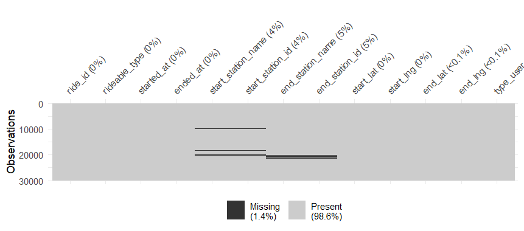
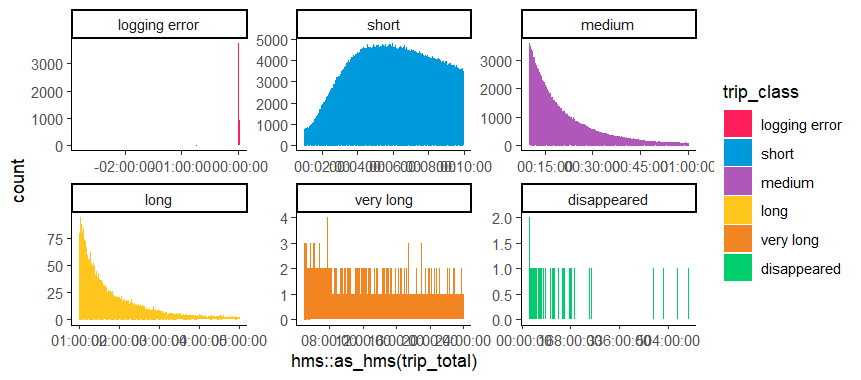
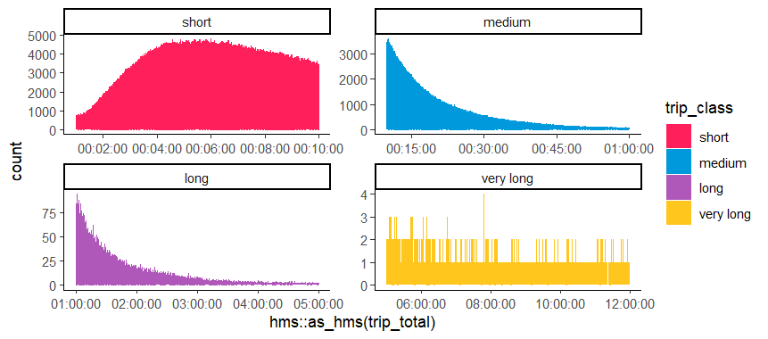
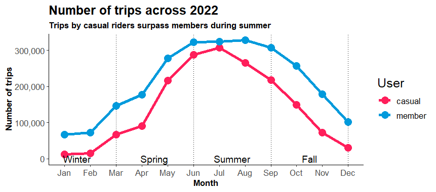
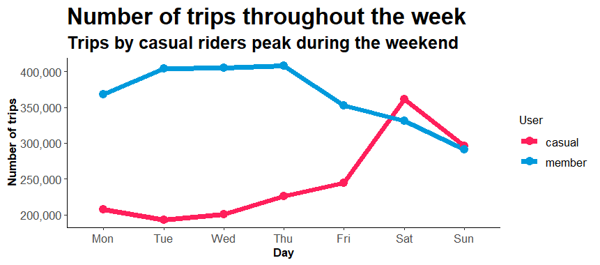
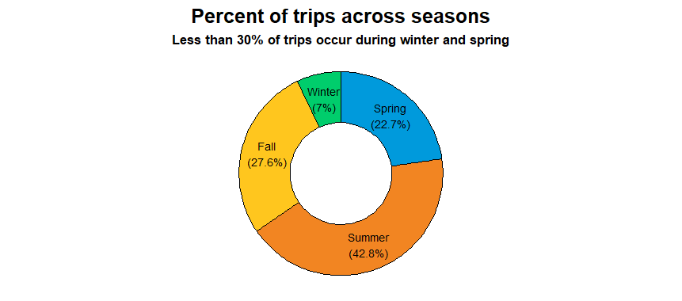
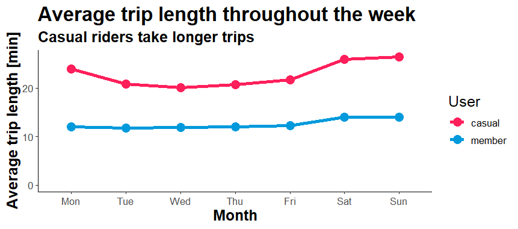
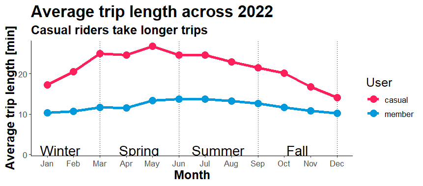

```{r eval=FALSE}
#load packages
suppressMessages(library(tidyverse)) # data wrangling 
library(visdat) # visualize aspects of a data frame. Here NAs
library(ggplot2) # plotting
suppressMessages(library(lubridate)) # working with dates and times
library(skimr) # summary statistics of variables and data frames
library(repr) # used for resizing plot area under code chunks
suppressMessages(library(scales)) # required for "labels = comma"
```


## **Data Validation**

-   To enable more efficient and comprehensive analysis, it was necessary to **upload the individual data files into new vectors and combine them into a single, large dataset**. This process involved merging the data frames into a cohesive whole, allowing for more effective analysis and interpretation of the data.


```{r eval=FALSE}
#----------------------------------------------------------------------------------#
#Import Data
january_2022 <- read.csv("202201-divvy-tripdata.csv")
february_2022 <- read.csv("202202-divvy-tripdata.csv")
march_2022 <- read.csv("202203-divvy-tripdata.csv")
april_2022 <- read.csv("202204-divvy-tripdata.csv")
may_2022 <- read.csv("202205-divvy-tripdata.csv")
june_2022 <- read.csv("202206-divvy-tripdata.csv")
july_2022 <- read.csv("202207-divvy-tripdata.csv")
august_2022 <- read.csv("202208-divvy-tripdata.csv")
september_2022 <- read.csv("202209-divvy-publictripdata.csv")
october_2022 <- read.csv("202210-divvy-tripdata.csv")
november_2022 <- read.csv("202211-divvy-tripdata.csv")
december_2022 <- read.csv("202212-divvy-tripdata.csv")
#----------------------------------------------------------------------------------#
```

<br>


## **Import Data**

- Import all data and append into one data frame using bind_rows().

```{r eval=FALSE}
tripdata <- list.files(path = "C:/Users/Ark Blaze/Documents/R Projects/",
                      pattern =  "*.csv",
                      full.names = TRUE)
                      lapply(read_csv, col_names = TRUE, show_col_types = FALSE)
                      bind_rows()
                      rename("type_user" =
                               member_casual) 

# rename the column that describes the type of user
```


### **Quick skimming**

- Have a quick look at the head of the data frame to check column names and some summary statistics characterizing the data set using skim().

```{r eval=FALSE}
head(divy_tripdata_2021) # head of data frame
skim(divy_tripdata_2021) # quick sum stats
```

<br>


## **Data Processing**


-To make sure we work with high quality data, we will check for duplicates, missing values.


1) Identify duplicates
Identify duplicates in "ride_id".

```{r eval=FALSE}
duplicates_ride_id <- tripdata[tripdata$ride_id %in% tripdata$ride_id[duplicated(tripdata$ride_id)],]
duplicates_ride_id # print douplicate entries
```


2) Identify and remove missing values (NAs)

We will remove observations that contain missing values to prevent issues during the down stream analysis. the vis_miss() function from the visdat package is used for a visualization of NAs in the first 30.000 rows.

```{r eval=FALSE}
vis_miss(head(tripdata,30000))
# visualize NAs for first 30.000 rows

colnames(tripdata)[colSums(is.na(tripdata)) > 0]
# identify columns containing missing values

tripdata <- tripdata %>%
    drop_na(colnames(tripdata)[colSums(is.na(tripdata)) > 0])
# drop rows containing missing values
```


<br>


#### *Add total trip time (trip_total)*

- Use the difftime() function to add the duration of individual trips (trip_total).

```{r eval=FALSE}
tripdata <- tripdata %>%
  mutate(trip_total = round( difftime(ended_at, started_at, units = c('mins')),2))
head(tripdata %>% select(ride_id, type_user, trip_total)) # print head
```


#### **Classify trip duration**

Categorize trips into:

-logging error < 1 mins
-short between 1 and 10 mins
-medium between 10 and 60 mins
-long between 60 and 300 mins
-very long between 300 and 1440 mins
-disappeared > 1440 mins


This allows us to split the plot using facet_wrap() and have a closer look at the distribution of trip_total.

```{r eval=FALSE}
# Create new column "trip_class" containing a categorical label classifying trip length
tripdata <- tripdata %>%
  mutate(
    trip_class = case_when(
      trip_total < 1 ~ "logging error",
      trip_total >= 1 & trip_total < 10 ~ "short",
      trip_total >= 10 & trip_total < 60 ~ "medium",
      trip_total >= 60 & trip_total < 300 ~ "long",
      trip_total >= 300 & trip_total < 1440 ~ "very long",
      trip_total >= 1440  ~ "disappeared"))

#convert trip_calss to factor and order levels
tripdata <- tripdata %>%
    mutate(trip_class = factor(trip_class, levels = c("logging error", "short", "medium", "long", "very long", "disappeared")))
```


#### *Plot counts faceted by trip class* 

-  Now check count distribution across trip duration. We will use facet_wrap() to split plot by "trip_class".




```{r eval=FALSE}
options(repr.plot.width = 10, repr.plot.height = 5) # set dimensions of plots
# Plot
tripdata %>%
  ggplot(aes(x = hms::as_hms(trip_total), fill = trip_class, color = trip_class)) +
  geom_bar() +
  facet_wrap( ~ trip_class, scales = "free") +
  theme_classic() +
  scale_color_manual(values = c( '#FF1F5B', '#009ADC', '#AF58BA', '#FFC61E',  '#F28522', '#00CD6C')) +
  scale_fill_manual(values = c('#FF1F5B', '#009ADC', '#AF58BA', '#FFC61E', '#F28522', '#00CD6C'))
```

<br>


#### **Filter trip duration**

- Exclude entries where there is either a negative time recorded, the trip duration is < 1 mins or > 1440 mins.



```{r eval=FALSE}
# filter condition
times_are_off <-
  filter(tripdata, ended_at < started_at | trip_total < 1 | trip_total > 720)

# apply filter and remove times that are off
tripdata_clean <- tripdata %>%
    filter(!ride_id %in% times_are_off$ride_id) %>%
      filter(!start_station_name %in% 
        c('DIVVY CASSETTE REPAIR MOBILE STATION') |
        !end_station_name %in%
        c('DIVVY CASSETTE REPAIR MOBILE STATION'))
```


##### **Plot remaining trips**

-  Plot data after filtering. There should be no negative logins, trips < 1 mins or >720 mins left.

```{r eval=FALSE}
tripdata_clean %>%
  ggplot(aes(x = hms::as_hms(trip_total), fill = trip_class, color = trip_class)) +
  geom_bar() +
  facet_wrap( ~ trip_class, scales = "free") +
  theme_classic() +
  scale_color_manual(values = c('#FF1F5B', '#009ADC', '#AF58BA', '#FFC61E', '#F28522', '#00CD6C')) +
    scale_fill_manual(values = c('#FF1F5B', '#009ADC', '#AF58BA', '#FFC61E', '#F28522', '#00CD6C'))
```


#### **Add hour, week day, month**

-To be able to calculate summary statistics for hours, days of the week and individual months we can use the information contained in the "started_at" column to create the new columns: hour, day_week, day_month and month.

```{r eval=FALSE}
# add new columns for "hour", "day_week", "day_month"
tripdata_final$date <- as.Date(tripdata_final$started_at)
tripdata_final$week_day <- format(as.Date(tripdata_final$date), "%A")
tripdata_final$month <- format(as.Date(tripdata_final$date), "%b_%y")
tripdata_final$year <- format(tripdata_final$date, "%Y")

#Separate column for time
tripdata_final$time <- as.POSIXct(tripdata_final$started_at, format = "%Y-%m-%d %H:%M:%S")
tripdata_final$time <- format(tripdata_final$time, format = "%H:%M")

# Set factor levels for month & days. To display months & days in sequential order in plots (default is alphabetical).
tripdata_final <- tripdata_final %>%
  mutate(month = factor(month, levels = c("Jan", "Feb", "Mar", "Apr", "May", "Jun", "Jul", "Aug", "Sep", "Oct", "Nov", "Dec")),
         week_day = factor(day_week, levels = c("Mon", "Tue", "Wed", "Thu", "Fri", "Sat", "Sun")))


write.csv(tripdata_clean,file = "tripdata_final.csv",row.names = FALSE)
```

<br>


##  ***Exploratory analysis***


There are various things that can be analysed with this data. Here we will look at the following:

#### **1. Number of trips by user type**
#### **2. Average trip length by users**
#### **3. Top 25 routes**


#### **1. Number of trips by user type**

#### **1.1 Percent of trips across seasons**
An obvious question is how the number of trips varies across the seasons.

```{r eval=FALSE}
# Calculate percent per month
trips_percent_month <- tripdata_final %>%
  group_by(month) %>%
  summarise(count = n()) %>%
  mutate(percent = round(100 * count / sum(count), 1)) %>%
  mutate(percent_label = paste0(month, "\n", "(", round(100 * count / sum(count), 1), '%', ")")) %>%
  select(month, percent, percent_label)
  
# Calculate percent per season
trips_percent_season <- tripdata_final %>%
  mutate(season = case_when(month == "Jan" ~ "Winter",
                            month == "Feb" ~ "Winter",
                            month == "Mar" ~ "Spring",
                            month == "Apr" ~ "Spring",
                            month == "May" ~ "Spring",
                            month == "Jun" ~ "Summer",
                            month == "Jul" ~ "Summer",
                            month == "Aug" ~ "Summer",
                            month == "Sep" ~ "Fall",
                            month == "Oct" ~ "Fall",
                            month == "Nov" ~ "Fall",
                            month == "Dec" ~ "Winter")) %>%
  mutate(season = factor(season, levels = c("Spring", "Summer", "Fall", "Winter"))) %>%
  group_by(season) %>%
  summarise(count = n()) %>%
  mutate(percent = round(100 * count / sum(count), 1)) %>%
  mutate(percent_label = paste0(season, "\n", "(", round(100 * count / sum(count), 1), '%', ")")) %>%
  select(season, percent, percent_label)
trips_percent_season[,3] # print 5 of trips per season
```

<br>


#### **1.2 Number of trips across the week and month**

Calculate the summary statistics for week days and months and create a figure for sharing with stake holders.

```{r eval=FALSE}
# calculate summary statistics per month
sum_stats_month <- tripdata_final %>%
  group_by(type_user, month) %>%
  summarise(
    'trips' = n(),
    'time_mean' = mean(trip_total),
    'time_median' = median(trip_total),
    .groups = 'drop') %>%
  mutate(type_user = as.factor(type_user))

# calculate summary statistics per week
sum_stats_week <- tripdata_final %>%
  group_by(type_user, day_week) %>%
  summarise('trips' = n(),
            'time_mean' = mean(trip_total),
            'time_median' = median(trip_total), 
            .groups = 'drop') %>%
  mutate(type_user = as.factor(type_user))
```


```{r eval=FALSE}
options(repr.plot.width = 30, repr.plot.height = 10) # set dimensions of plots

# Plot 1 average trip length across the week
number_trips_week_plot <- sum_stats_week %>%
  ggplot(aes(x = day_week, y =  trips, group = type_user, color = type_user, fill = type_user)) +
  geom_line(aes(color = type_user), size = 1.5) + # add line to plot
  geom_point(size = 6) + # add dot plot
  theme_classic() + # apply classic theme
  scale_color_manual(values=c('#FF1F5B', '#009ADC')) +
  expand_limits(y = 0) + # force start of y axis at 0
  theme(plot.title = element_text(face = "bold", size = 30), #change title size and face
        plot.subtitle = element_text(face = "bold", size = 20), #change subtitle size and face
        axis.text = element_text(size = 20), # change axis label font size
        axis.title = element_text(size = 25, face = "bold"), # change axis title font size
        legend.title = element_text(size = 20), # change legend title font size
        legend.text = element_text(size = 16)) + # change legend text font size
        scale_y_continuous(labels = comma) + # format scale of y axis
  labs(title= "Number of trips throughout the week", subtitle = "Trips by casual riders peak during the weekend", x = "Day", y = "Number of trips", color = "User ", fill = "User ")

# Plot 2 average trip length across the months
number_trips_months_plot <- sum_stats_month %>%
  ggplot(aes(x = month, y =  trips, group = type_user, color = type_user, fill = type_user)) +
  geom_line(aes(color = type_user), size = 1.5) + # add line to plot
  geom_vline(xintercept = c(0, 3, 6, 9, 12), linetype = 'dotted') + # add dotted line to delineate seasons
  geom_point(size = 6) + # add dot plot
  theme_classic() + # apply classic theme
  scale_color_manual(values=c('#FF1F5B', '#009ADC')) + # change color to custom values
  theme(plot.title = element_text(face = "bold", size = 30), # change title size and face
        plot.subtitle = element_text(face = "bold", size = 20), # change subtitle size and face
        axis.text = element_text(size = 20), # change axis label font size
        axis.title = element_text(size = 25, face = "bold"), # change axis title font size
        legend.title = element_text(size = 20), # change legend title font size
        legend.text = element_text(size = 16)) + # change legend text font size
  scale_y_continuous(labels = comma) + # format scale of y axis
  labs(title= "Number of trips across 2021", subtitle = "Trips by casual riders surpass members during summer", x = "Month", y = "Number of trips", color = "User ", fill = "User ") +
  annotate("text", x = c(1.5, 4.5, 7.5, 10.5), # x-coordinates of season labels
            y = c(1, 1, 1, 1), label = c("Winter", "Spring", "Summer", "Fall"), size = 10)


# plot percent of trips per season
trips_percent_season$ymax <- cumsum(trips_percent_season$percent) # top of each rectangle
trips_percent_season$ymin <- c(0, head(trips_percent_season$ymax, n=-1)) # bottom of each rectangle
trips_percent_season$labelPosition <- (trips_percent_season$ymax + trips_percent_season$ymin) / 2 # label position


# plot trips percent per season
trips_percent_season_plot <- ggplot(trips_percent_season, aes(ymax=ymax, ymin=ymin, xmax=4, xmin=3, fill=season)) +
  geom_rect(color = "black") +
  geom_label( x=3.5, aes(y=labelPosition, label=percent_label), size=6,label.size = NA, alpha = 0) +
  scale_fill_manual(values=c( '#009ADC', '#F28522','#FFC61E','#00CD6C')) + # change fill to custom values
  coord_polar(theta="y") +
  xlim(c(2, 4)) +
  theme_void() +
  theme(legend.position = "none") +
  labs(title= "Percent of trips across seasons", subtitle = 'Less than 30% of trips occur during winter and spring') +
  theme(plot.title = element_text(face = "bold", size = 30, hjust = 0.5), plot.subtitle = element_text(face = "bold", size = 20, hjust = 0.5))

```
<br>


#### **Figure 1: Number of trips by users across week days and months**

-Plotting the number of trips for casual users and members across the week and month reveals some interesting patterns. Fig:1.1 Casual users show a doubling the number of trips during the weekend, whereas the number of trips taken by members is more stable. Fig:1.2 Across the year, casual user account for a lower number of trips during winter, spring and fall than members but surpass them during the summer months July and August. Fig:1.3 The majority of trips is undertaken during summer and fall, with less than 30% during winter and spring. 


{width="600"}

{width="600"}
{width="500}


<br>

#### **2 Average trip length by users **

- Now let's look at whether the average trip duration differs between casual users and annual members.

```{r eval=FALSE}
options(repr.plot.width = 20, repr.plot.height = 10) # set dimensions of plots
# Plot 1 average trip length across the week
ggplot(data = sum_stats_week, aes(x = day_week, y =  `time_mean`, group = type_user, color = type_user, fill = type_user)) +
  geom_line(aes(color = type_user), linewidth = 1.5) + # add line to plot
  geom_point(size = 4) + # add dot plot
  theme_classic() + # apply classic theme
  scale_color_manual(values=c('#FF1F5B', '#009ADC')) + # change fill to custom values
  expand_limits(y = 0) + # force start of y axis at 0
  theme(plot.title = element_text(face = "bold", size = 20), # change title size and face
        plot.subtitle = element_text(face = "bold", size = 15), # change subtitle size and face
        axis.text = element_text(size = 10), # change axis label font size
        axis.title = element_text(size = 15, face = "bold"), # change axis title font size
        legend.title = element_text(size = 15),    # change legend title font size
        legend.text = element_text(size = 10)) + # change legend text font size
  scale_y_continuous() + # format scale of y axis
  labs(title = "Average trip length throughout the week", subtitle = 'Casual riders take longer trips', x = "Month", y = "Average trip length [min]", color = "User ", fill = "User ")

# Plot 2 average trip length across the months
ggplot(data = sum_stats_month, aes(x = month, y =  `time_mean`, group = type_user, color = type_user, fill = type_user)) +
  geom_line(aes(color = type_user), linewidth = 1.5) + # add line to plot
  geom_vline(xintercept = c(0, 3, 6, 9, 12), linetype = 'dotted') + # add dotted line to delineate seasons
  geom_point(size = 4) + # add dot plot
  theme_classic() + # apply classic theme
  scale_color_manual(values=c('#FF1F5B', '#009ADC')) + # change color to custom values
  theme(plot.title = element_text(face = "bold", size = 20), # change title size and face
        plot.subtitle = element_text(face = "bold", size = 15), # change subtitle size and face
        axis.text = element_text(size = 10), # change axis label font size
        axis.title = element_text(size = 15, face = "bold"), # change axis title font size
        legend.title = element_text(size = 15), # change legend title font size
        legend.text = element_text(size = 10)) + # change legend text font size
  scale_y_continuous() + # format scale of y axis
  labs(title = "Average trip length across 2022", subtitle = 'Casual riders take longer trips', x = "Month", y = "Average trip length [min]", color = "User ", fill = "User ") +
  annotate("text", x = c(1.5, 4.5, 7.5, 10.5), # x-coordinates of season labels
           y = c(1, 1, 1, 1), label = c("Winter", "Spring", "Summer", "Fall"), size = 6)
```


#### **Figure 2: Average trip length by users across week days and months **

- Plotting the average trip time for casual users and members across week days and month shows that casual users take on average longer trips than members. The average trip length of casual users is almost twice as much as the time spent cycling by members across week days. Similarly, the average trip time of casual users is considerably longer throughout the year, compared to members. 

{width="600}
{width="600"}

<br>

#### **3. Top 25 trips**

- Another question is what the top most frequented trips are and in which part of the city they occur. Here we can look at round trips (start station = end station) and trips that and at a different station.

```{r eval=FALSE}
# Make selection for trips that do not end at the start station
top_25_trips <-   tripdata_final %>%
  group_by(start_station_name, end_station_name) %>% # group by stations
  dplyr::summarize(count = n(), .groups = 'drop') %>% # count number of trips
  ungroup() %>% # remove grouping
  filter(start_station_name != end_station_name) %>% # filter for trips that do not end at the start station
  arrange(desc(count)) %>%
  top_n(25, wt = count)

# make table with updated header
top_25_trips_table <- top_25_trips %>%
    rename(`Start station` = start_station_name, `End station` = end_station_name, `Number of trips` = count)

# Make selection for trips that end at the start station
top_25_round_trips <- tripdata_final %>%
  group_by(start_station_name, end_station_name) %>% # group by stations
  dplyr::summarize(count = n(), .groups = 'drop') %>% # count number of trips
  ungroup() %>% # remove grouping
  filter(start_station_name == end_station_name) %>% # filter for trips that do not end at the start station
  arrange(desc(count)) %>%
  top_n(25, wt = count)

# make table with updated header
top_25_round_trips_table <- top_25_round_trips %>%
  rename(`Start station` = start_station_name, `End station` = end_station_name, `Number of trips` = count)

# Merge tables and arrange in descending order by "Number of trips"
top_25_trips_table %>% 
  mutate(`Trip type` = "one-way") %>%
  full_join(top_25_round_trips_table %>% 
              mutate(`Trip type` = "round trip"), by = c("Start station", "End station", "Number of trips", "Trip type")) %>%
  arrange(desc(`Number of trips`))
```

<br>


## **Summary of Analysis**


#### **1. Casual members and Annual members differ in their usage of shared bikes across the week**

The observation that the number of trips by annual members stays rather constant across the week with a slight drop towards the weekend suggests that members might use the bicycles to commute during business hours. In contrast, casual users show an overall lower usage of bikes during the week and a double the number of rides during the weekend. In addition, the average trip length is almost the double of that of annual members across weekdays suggesting that casual members use bicycles for different trips than annual members which would used potentially for leisure activities.
Casual riders tend to have longer ride duration's, averaging around 50% longer than annual members.
Annual members primarily use the bike-sharing service for commuting purposes, while casual riders tend to use it for leisure, particularly on weekends and in the summer months.

 
#### **2. Casual riders show a stronger season depending demand**

For both user types- Casual & Annual members, clear differences in bicycle demands are evident across the seasons. Overall, the demand for shared bicycles is lowest during fall and winter (Nov - Mar) and highest during summer and early fall (Jun - Sep). Interestingly, casual users show a lower demand across the year, except for the summer months July and August during which the trips taken by casual users exceeds the number of trips done by members. This could partially be explained by a shortage of bikes (ceiling effect) and annual members might take more trips if the number of available bikes would not be limited.


#### **3. Week days travel pass**

Considering the lower demand of casual users for bicycles during the week, offering a "week day pass" at a discount price could incentivise casual rides to use bikes more frequently on week days.


#### **4. Promotion campaign of annual membership during summer months**

The strong peak in demand for bicycles by casual users during summer provides an opportunity to acquire new members. To do so, targeted promotions in areas of the city that are most frequented by riders (based on top 25 routes), as well as within the mobile phone app could reach potential customers during the time of the year where they are most susceptible to sign up for the programme. Offering a discount on full memberships during these months might have a positive effect on signup numbers.

<br>


#### **Recommendations**

-   Increase marketing efforts targeting leisure riders, especially during the summer months and on weekends, in order to increase bike usage and revenue.
-   Consider offering discounts or incentives for annual members to encourage them to use the bikes more regularly throughout the week and year.
-   Evaluate the reasons for the low popularity of docked bikes among both annual members and casual riders, and consider reevaluating the offering or improving the service to increase usage.
-   Focus on improving the classic bike fleet, as it is the most popular among both annual members and casual riders.
-   Consider offering longer rental periods or multi-day rentals for casual riders, as their average ride length is longer than annual members, in order to increase revenue.
-   Increase marketing efforts targeting casual riders during the winter months in order to increase usage and revenue during traditionally slower periods.


#### \-\-\-\-\-\-\-\-\-\-\-\-\-\-\-\-\-\-\-\-\-\-\-\-\-\-\-\-\-\-\-\-\-\-\-\-\-\-\-\-\-\-\--End of Case Study------------------------------------------------
